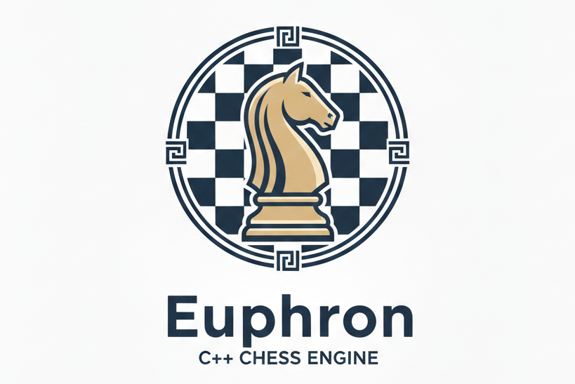

# Euphron - A UCI Chess engine



## Introduction

Euphron is a chess engine developed in C++ that aims to provide a strong and efficient playing experience. It is designed to be compatible with my [Chessgame](https://github.com/Omikrone/Chessgame) project, allowing users to play against the engine or use it for analysis. It uses the [Chessboard](https://github.com/Omikrone/Chessboard) library for handling the chessboard and game logic.

Euphron is currently a work-in-progress engine aimed at learning and experimentation, not at competing with top engines like Stockfish.

- Current version : 0.3.2

## Features

Euphron offers the following features:
- Implements the UCI (Universal Chess Interface) protocol for easy integration with chess GUIs.
- Implements an optional API Wrapper for communication with the [Chessgame](https://github.com/Omikrone/Chessgame) project.
- Basic evaluation function considering only material balance.
- Negamax search algorithm for move selection.
- Alpha-Beta pruning to optimize the search process.
- Quiescence search to avoid the horizon effect (stabilizing the evaluation in volatile positions).
- MVV-LVA (Most Valuable Victim - Least Valuable Aggressor) move ordering to improve search efficiency.
- Iterative deepening to progressively deepen the search, if the given time allows.


## Installation

### Docker

To install Euphron with Docker and integrate it with the Chessgame project, please refer to the [Chessgame README](https://github.com/Omikrone/Chessgame), where the Docker setup is explained in detail.

### Manual Installation

If you prefer to install Euphron and launch it separately, follow these steps:

1. Clone the repository:
```bash
git clone https://github.com/Omikrone/Euphron.git
cd Euphron
```

2. Build the project using CMake:
```bash
cmake -S . -B build
cmake --build build --config Release
```

3. To run the engine with the API Wrapper enabled, use the following command:
```bash
./build/chessengine --http
```
The engine will start and listen for HTTP requests on the default port (18080). You can then open a websocket connection to `ws://localhost:18080/engine/<int>` to send the engine UCI commands for a specific game.

If you want to run the engine without the API Wrapper, simply execute:
```bash
./build/chessengine
```

## Usage (UCI)

You can use Euphron with any UCI-compatible GUI (Arena, CuteChess, Banksia, etc.).

Example:
```text
uci
isready
position startpos moves e2e4 e7e5
go depth 4
```

## Roadmap

Planned features:
- Improved evaluation function (piece-square tables, mobility)
- Transposition table
- Multi-threading support